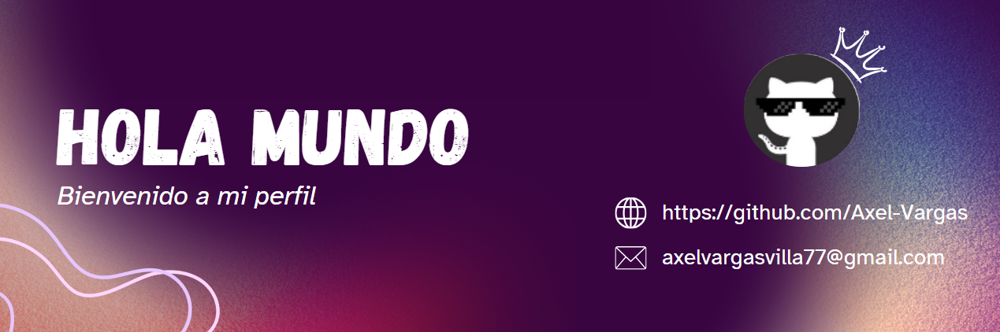

<!--Banner-->

    

 

<!--Night Owl image-->

  

<!--Header Name-->
#  Soy Axel! 
*Desarrollador / Programador*
  

<!--Start Intro-->               

Soy un desarrollador Frontend apasionado y un entusiasta del aprendizaje autónomo, con un gran amor por tecnologías como Angular, React.js, IONIC y visualización de datos. También tengo experiencia en desarrollo Full Stack, incluyendo Node.js y PHP. 

- ✨ Estudiante de la vida :)
- 🌱 Actualmente me encuentro estudiando y creo que cada día es una oportunidad de aprendizaje.
- ❤ Contribuyendo al código abierto.
- 💻 Visita mi [Portafolio](https://kiran1689.github.io) para obtener más detalles sobre mi.
<!--End Intro-->

<!--Profile Count Badge-->

  

---

<!--Languages and Tools Section-->       
<h2 align="center">Aprendizajes y Conocimientos</h2> 
<picture>
  <source media="(prefers-color-scheme: dark)" srcset="./Skills_Animation_Dark.gif">
  <source media="(prefers-color-scheme: light)" srcset="./Skills_Animation_White.gif">
  
</picture>
 

<h3 align="left">Aprendizajes Actuales</h3>
<ul align="left">
  <li>Profundizando en características avanzadas de Angular.</li>
  <li>Aprendiendo a construir aplicaciones móviles multiplataforma utilizando IONIC y Angular o React</li>
  <li>Ampliando mis conocimientos en el backend con Node.js</li>
</ul>

<h3 align="left">Conocimientos</h3>
<ul align="left">
  <li><b>Desarrollo Web:</b> Conocimiento en HTML, CSS y Angular para crear interfaces interactivas.</li>
  <li><b>Lenguajes de Programación:</b> Experiencia en PHP, Java y Node.js para el desarrollo del lado del servidor.</li>
  <li><b>Bases de Datos:</b> Competencia en MySQL, FireBase, MongoDB y SQLServer para la gestión y manipulación de datos.</li>
</ul>
  
 
 
 
 

<!--Trophies Section-->   
<h2 align="center">🏆 Trofeos de Github 🏆</h2>

  <a href="https://github.com/Axel-Vargas">
    <picture>
      <source media="(prefers-color-scheme: dark)" srcset="https://github-profile-trophy.vercel.app/?username=Axel-Vargas&no-bg=true&row=2&column=6&margin-w=20&margin-h=20&theme=monokai">
      <source media="(prefers-color-scheme: light)" srcset="https://github-profile-trophy.vercel.app/?username=Axel-Vargas&no-bg=true&row=2&column=6&margin-w=20&margin-h=20">
      
    </picture>
  </a>

 

<!--Github stats Table--> 
<h2 align="center">📊 Estadisticas de Github 📊</h2>

<table width="100%">
  <tr>
    <td width="50%">
      <h3 align="center"><strong>Estadisticas de Github</strong></h3>
      

        
      

    </td>
    <td width="50%">
      <h3 align="center"><strong>Estadísticas de Racha</strong></h3>
      

        
      

    </td>
  </tr>
  <tr>
    <td width="50%">
      <h3 align="center"><strong>Último Proyecto</strong></h3>
      

        
      

    </td>
    <td width="50%">
      <h3 align="center"><strong>Contribuciones Principales</strong></h3>
      

        
      

    </td>
  </tr>
</table>
 

<!--Contribution Graph-->
<h2 align="center">📈 Gráfica de Contribución 📈</h2>

    

---

<!--Dynamic Quote card updates everyday at 12 PM--> 
<h2 align="center">🌟 Pensamiento del Dia 🌟</h2>

<!--STARTS_HERE_QUOTE_CARD-->

    

<!--ENDS_HERE_QUOTE_CARD-->

<!--Contact Section--> 

<h2 align="center">🤝 Contáctate conmigo 🤝 </h2>

  

 

<!--Footer--> 

  

